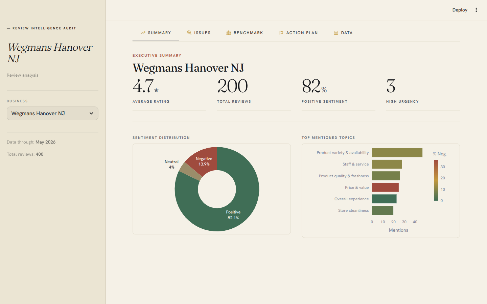

# review-insights

A productized service that turns raw customer reviews into an executive report + interactive dashboard.



## What you get

- **Interactive dashboard** — sentiment breakdown, topic analysis, urgency heatmap, competitor benchmark, action plan.
- **Executive PDF report** — 5-8 pages, ready to present. No technical background needed to read it.
- **Prioritized action plan** — ranked by mention volume × urgency × % negative sentiment.

## How it works

Raw Google Maps reviews → LLM classification (sentiment, topic, urgency) → aggregation → dashboard + PDF.

```
ingestion → cleaning → classification → aggregation → dashboard / report
```

## Stack

- Python, pandas, Pydantic
- Gemini 2.5 Flash (classification + insight enrichment)
- Streamlit + Plotly (dashboard)
- Jinja2 + Playwright (PDF)

## Quick start

```bash
git clone <repo-url>
cd review-insights
pip install -e .

cp .env.example .env
# Fill in GEMINI_API_KEY

python run_pipeline.py      # runs the full pipeline
streamlit run app.py        # launches the dashboard
```

## Repo layout

| Path | Purpose |
|---|---|
| `app.py` | Streamlit dashboard entry point |
| `run_pipeline.py` | End-to-end pipeline runner |
| `src/review_insights/` | Package: ingestion, cleaning, classification, aggregation, reporting |
| `prompts/` | Versioned LLM prompts |
| `data/{0_input..5_enriched}/` | Pipeline stages: input JSONs → raw → clean → classified → aggregated → enriched |

## License

Proprietary — all rights reserved.

## Author

[Joaquin Ferrer](https://www.linkedin.com/in/joaquínferrer) — Industrial & Analytics Engineer.
